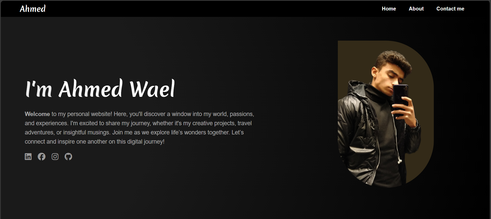

# Full Stack Python Labs

This repository contains lab solutions from my Full Stack Web Development course using Python.  
Each folder contains labs related to a specific topic in the course.

## 📁 Folders and Their Contents

### 🔷 HTML/
Labs focused on HTML structure and elements.  
**Labs:** Lab 1, Lab 2  
**Examples:**  
- Creating a basic HTML page  
- Using semantic tags  
- Forms and inputs

---

### 🔷 CSS/
Labs related to styling with CSS.  
**Labs:** Lab 3, Lab 3(1)  
**Examples:**  
- CSS selectors and properties  
- Flexbox and Grid  
- Responsive design

---

### 🔷 JavaScript/
Labs involving client-side scripting with JavaScript.  
**Labs:** Lab 4, Lab 5, Lab 7  
**Examples:**  
- DOM manipulation  
- Events and functions  
- Simple interactivity

---

### 🔷 Portfolio/
My own website project or showcase combining all learned topics.  
**Labs:** Lab 6  
**Examples:**  
- Personal portfolio with multiple pages  
- Contact form with validation  
- Clean, responsive layout using HTML, CSS, JS

<table>
  <tr>
    <th>Portfolio v1</th>
    <th>Portfolio v2</th>
    <th>Portfolio v3</th>
  </tr>
  <tr>
    <td></td>
    <td></td>
    <td></td>
  </tr>
</table>

---

### 🔷 Bootstrap/
Labs using Bootstrap framework for fast UI development.  
**Labs:** Lab 8  
**Examples:**  
- Grid system  
- Components (cards, modals, navbars)  
- Theming

---

### 🔷 Database/
Labs related to working with databases and SQL.  
**Labs:** Lab 9, Lab 10, Lab 11  
**Examples:**  
- Creating tables  
- Writing SELECT, INSERT queries  
- Connecting to databases using Python

---

### 🔷 Python/
Labs focused on Python programming.  
**Labs:** Lab 12, Lab 13, Lab 14, Lab 15, Lab 16  
**Examples:**  
- File handling  
- Functions and loops  
- Data manipulation

---

### 🔷 Django/
Labs involving the Django web framework.  
**Labs:** Lab 16(1), Lab 17, Lab 18, Lab 19, Lab 20  
**Examples:**  
- Creating Django projects and apps  
- Models, views, templates  
- Admin panel and routing

---

## ✅ Notes
- Each lab is contained in its own folder inside the relevant topic.
- Labs are organized for learning and revision purposes.
- The project will be updated weekly as I progress through the course.

---

## 👨‍💻 Author
Ahmed Wael – Full Stack Web Development Student @ ITI
